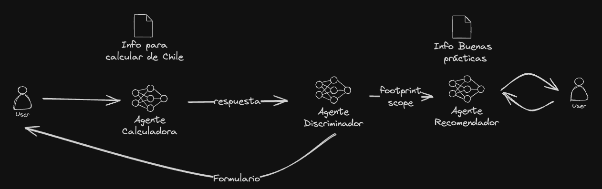

# 🏆🏆 1º Lugar Hackaton “IA por el futuro” 🏆🏆

# Descripción

En este repositorio se encuentra el código utilizado en la hackaton “IA por el futuro” organizado por Desafio Latam y CodeGPT. El objetivo de la hackathon era desarrollar una solución utilizando IA (con la tecnología de CodeGPT) que impacte positivamente en alguno de los Desafíos de Desarrollo Sostenible Propuestos por la ONU.

## Equipo 🚀

Nuestra solución fue llamada ♻️ **Ecotracker**. El equipo fue conformado por:

- Luis Sanchez
- Diego Machado
- Nicolas Leiva
- Danko Abraham
- Leandro Supanta

# **Ecotracker ♻️**

Ecotracker utilizaba Large Language Models para estimar la huella de carbono de una persona en 3 scopes diferentes: Hogar, Transporte y Estilo de Vida. Además daba recomendaciones sobre como disminuir la huella de carbono del usuario, y respondía preguntas relacionadas al tópico en cuestión.

Para lograr esto, utilizamos 3 agentes: 

1. Agente Calculadora: Este agente era el encargado de estimar la huella de carbono del usuario, haciendo preguntas según el scope seleccionado por el usuario. El cálculo puede mejorarse utilizando una API y Function Calling. Éste agente fue alimentado con documentos con información actual necesaria para hacer los cálculos, además de información sobre cómo hacerlos.
2. Agente Mitigador: Este agente era especializado en recomendaciones para disminuir la huella de carbono. Fue alimentado con documentos sobre la huella de carbono y posibles soluciones para mitigar el exceso de huella de carbono emitida por el usuario.
3. Agente Discriminador: Este agente era el encargado de dirigir al usuario al Agente Mitigador una vez se habian respondido las preguntas y se habian obtenido la información necesaria para dar recomendaciones: Scope y Huella de carbono estimada.

A continuación les dejamos una imagen con la arquitectura de la solución.

Nota: Los agentes fueron creados en CodeGPT, lo que facilitó el desarrollo de la solución. Probablemente no podrás correr el código debido a que los agentes son privados. En un futuro esperamos liberarlos o alternativamente entregar los prompt y documentos necesarios para replicarlos.

# Agradecimiento ✨

Cabe destacar que esta solución es totalmente mejorable, considerar que tuvimos aproximadamente 5 horas para desarrollar todo, incluyendo el pensar la idea y hacer la presentación. Cualquier contribución o feedback es totalmente bienvenido y agradecido.

Como equipo agradecemos a los equipo organizadores: Desafio Latam y CodeGPT. Además de todas las personas a cargo, mentores, jueves y patrocinadores. ¡Fue un evento increible!